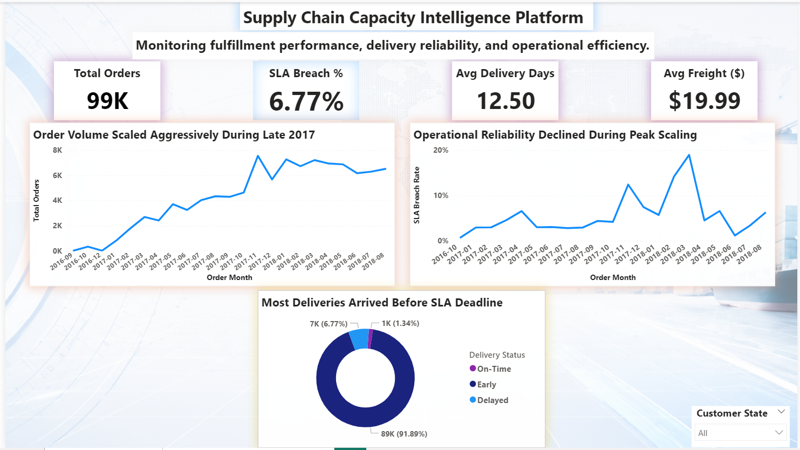
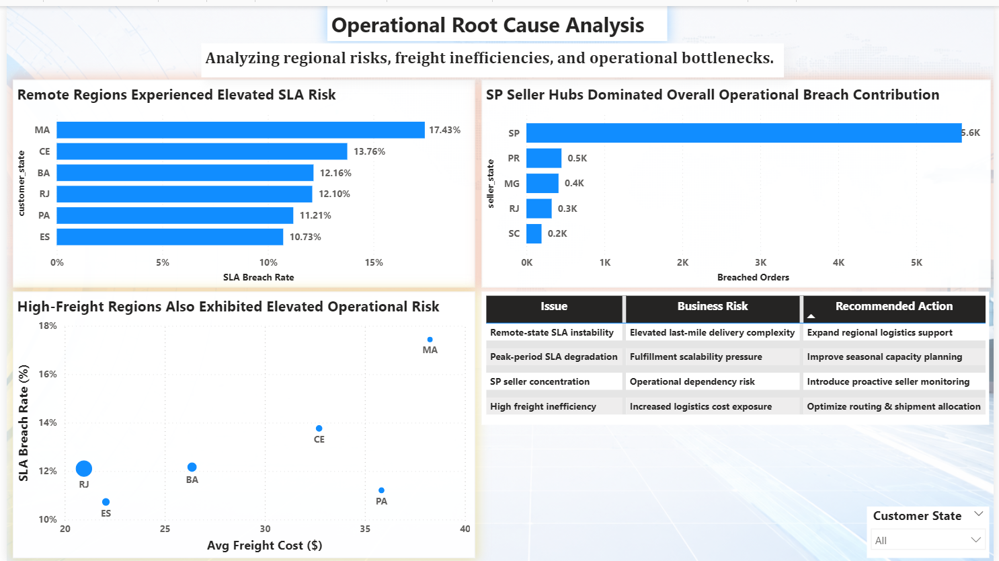

# 🚚 Supply Chain Capacity Intelligence Platform

An end-to-end supply chain analytics and operational intelligence project built using Power BI, SQL, and Python.

This project analyzes delivery reliability, SLA breach behavior, freight inefficiencies, seller-side bottlenecks, and regional operational risk using the Brazilian Olist e-commerce dataset.

The dashboard was designed to support executive-level operational monitoring, logistics intelligence, and strategic supply chain decision-making.

---

# 📊 Executive Overview Dashboard

High-level executive monitoring dashboard focused on:
- SLA reliability
- operational order trends
- delivery efficiency
- freight performance



---

# 🔍 Operational Root Cause Analysis Dashboard

Operational diagnostics dashboard designed to identify:
- high-risk delivery regions
- freight inefficiencies
- logistics bottlenecks
- operational scaling pressure



---

# 📌 Business Problem

Modern e-commerce supply chains face persistent operational challenges related to:
- delayed deliveries
- logistics scalability
- freight inefficiencies
- regional SLA breaches
- fulfillment performance variability

As operational demand increases, these challenges can significantly impact:
- customer satisfaction
- transportation costs
- delivery timelines
- logistics planning
- fulfillment efficiency

This project was developed to generate actionable operational intelligence for supply chain performance optimization and executive decision-making.

---

# 🎯 Project Objectives

The primary objectives of this project were to:

- Monitor delivery reliability and SLA adherence
- Identify operational bottlenecks across customer regions
- Analyze freight cost inefficiencies
- Evaluate seller-side fulfillment concentration risk
- Track operational performance trends over time
- Generate executive-level business insights and recommendations
- Build an interactive Power BI dashboard for logistics intelligence monitoring

---

# 🗂 Dataset Overview

## Dataset Source
Brazilian E-Commerce Public Dataset by Olist

Source:
https://www.kaggle.com/datasets/olistbr/brazilian-ecommerce

## Dataset Description

The dataset contains operational e-commerce information related to:
- customer orders
- seller operations
- freight costs
- delivery timelines
- regional customer activity
- logistics performance

The analysis was performed using cleaned operational datasets focused on:
- orders
- customers
- order items
- sellers

---

# 🛠 Tools & Technologies

| Category | Tools Used |
|---|---|
| Business Intelligence | Power BI |
| Programming | Python |
| Data Analysis | Pandas, NumPy |
| Data Visualization | Matplotlib, Seaborn |
| Database | PostgreSQL |
| Notebook Environment | Jupyter Notebook |
| KPI Engineering | DAX |
| Version Control | GitHub |

---

# 🧠 Dashboard Architecture

The Power BI dashboard was designed as a two-page executive operational intelligence system focused on delivery reliability, logistics performance, and supply chain risk monitoring.

## 📈 Page 1 — Executive Overview

The Executive Overview dashboard provides a high-level operational snapshot of delivery performance and fulfillment efficiency.

### Key KPIs

| KPI | Business Purpose |
|---|---|
| Total Orders | Tracks operational order volume |
| SLA Breach Rate | Measures delayed delivery exposure |
| Avg Delivery Duration | Evaluates fulfillment efficiency |
| Early Delivery % | Measures proactive delivery performance |
| Avg Freight Cost | Tracks logistics transportation cost |

### Executive-Level Visuals

- Monthly Orders Trend
- Monthly SLA Breach Trend
- Delivery Status Distribution
- KPI Monitoring Cards

### Business Focus

This page supports:
- executive monitoring
- operational performance tracking
- delivery reliability evaluation
- logistics health assessment

---

## 📉 Page 2 — Operational Root Cause Analysis (RCA)

The Operational RCA dashboard identifies the operational drivers behind SLA breaches, freight inefficiencies, and regional logistics risk.

### Operational Analysis Areas

| Analysis Area | Business Purpose |
|---|---|
| State-Level SLA Risk | Identifies high-risk delivery regions |
| Freight vs SLA Analysis | Evaluates logistics inefficiencies |
| Orders vs SLA Scatter Analysis | Detects operational scaling pressure |
| Strategic Recommendation Table | Supports executive decision-making |

### Key Operational Visuals

- Top Risk States by SLA Breach
- Orders vs SLA Breach Scatter Plot
- Freight Category vs SLA Breach Analysis
- Executive Recommendation Matrix

### Business Focus

This page supports:
- operational diagnostics
- logistics optimization
- regional risk monitoring
- strategic supply chain planning

---

# 🔍 Key Business Insights

The analysis identified several operational patterns and logistics risk signals:

- SLA reliability degraded during high-volume operational periods
- Remote customer regions exhibited elevated delivery delays
- High freight spending did not consistently improve delivery performance
- Seller concentration created operational dependency risk
- Logistics scalability pressure increased during peak demand cycles

---

# 🚀 Strategic Recommendations

Based on the operational analysis, the following recommendations were identified:

1. Expand logistics support for high-risk delivery regions.

2. Improve seasonal workforce and fulfillment capacity planning during peak demand periods.

3. Optimize freight routing for regions with elevated transportation costs and poor SLA reliability.

4. Reduce operational dependency on concentrated seller hubs.

5. Implement proactive monitoring systems for delivery-risk corridors and logistics bottlenecks.

---

# 📂 Repository Structure

```text
Supply-Chain-Capacity-Intelligence-Platform/
│
├── assets/
│   └── dashboard_background.png
│
├── dashboard/
│   └── Supply_Chain_Capacity_Intelligence.pbix
│
├── dataset/
│   └── dataset_information.md
│
├── dax-measures/
│   └── key_dax_measures.md
│
├── images/
│   ├── executive_overview.png
│   └── operational_root_cause_analysis.png
│
├── notebooks/
│   └── Supply_Chain_Capacity_Intelligence_Analysis.ipynb
│
├── sql/
│   └── business_queries.sql
│
└── README.md
```

---

# 📁 Project Files Description

| Folder | Description |
|---|---|
| assets/ | Dashboard design assets |
| dashboard/ | Final Power BI dashboard file |
| dataset/ | Dataset source and documentation |
| dax-measures/ | Core DAX KPI calculations |
| images/ | Dashboard preview images |
| notebooks/ | Python-based operational analytics notebook |
| sql/ | Consolidated business SQL queries |

---

# ⚙ How to Use

## Power BI Dashboard
1. Download the `.pbix` dashboard file from the `dashboard/` folder.
2. Open the file using Power BI Desktop.
3. Interact with dashboard visuals and operational filters.

## Python Notebook
1. Open the notebook from the `notebooks/` folder.
2. Run the cells sequentially using Jupyter Notebook or VS Code.
3. Review the exploratory analysis and operational insights.

## SQL Queries
1. Open `business_queries.sql` from the `sql/` folder.
2. Execute queries in PostgreSQL or any compatible SQL environment.
3. Analyze KPI logic, RCA analysis, and operational insights.

---

# 🧠 Final Note

This project demonstrates how operational analytics, KPI engineering, and executive dashboarding can be combined to support data-driven supply chain decision-making using Power BI, SQL, Python, and DAX.
